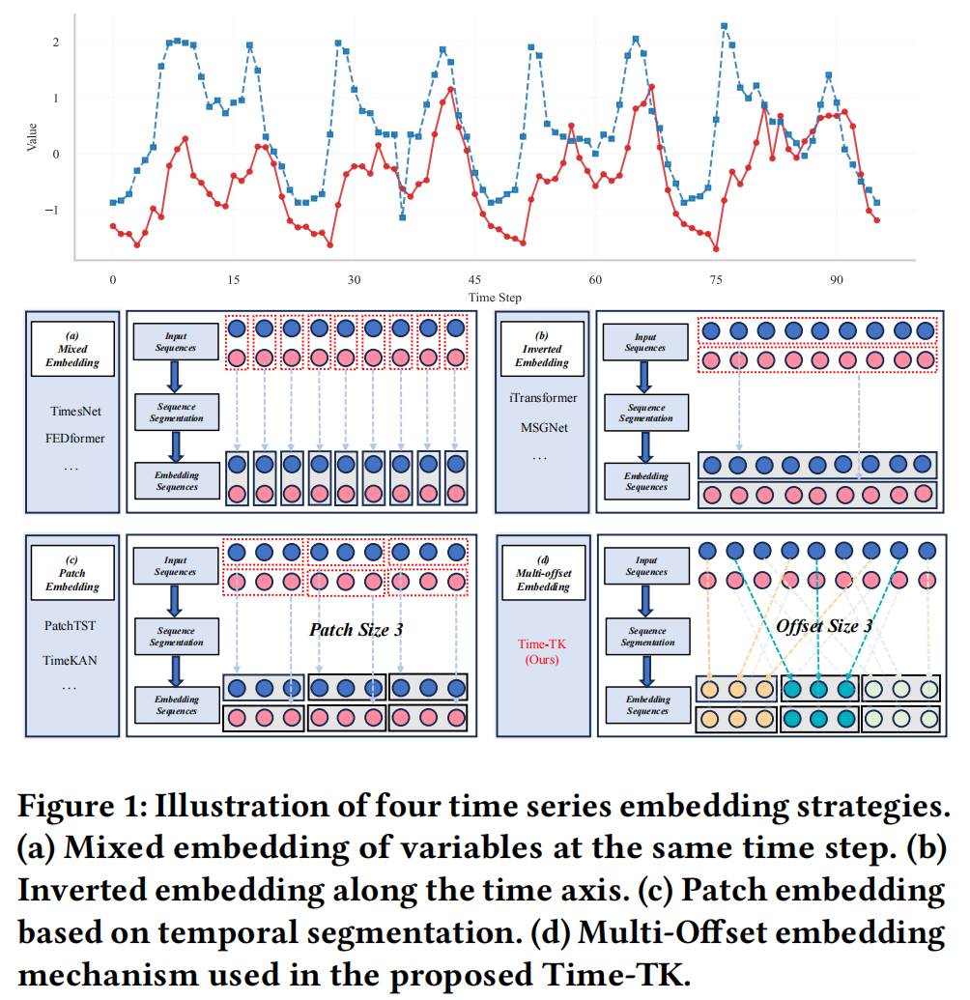
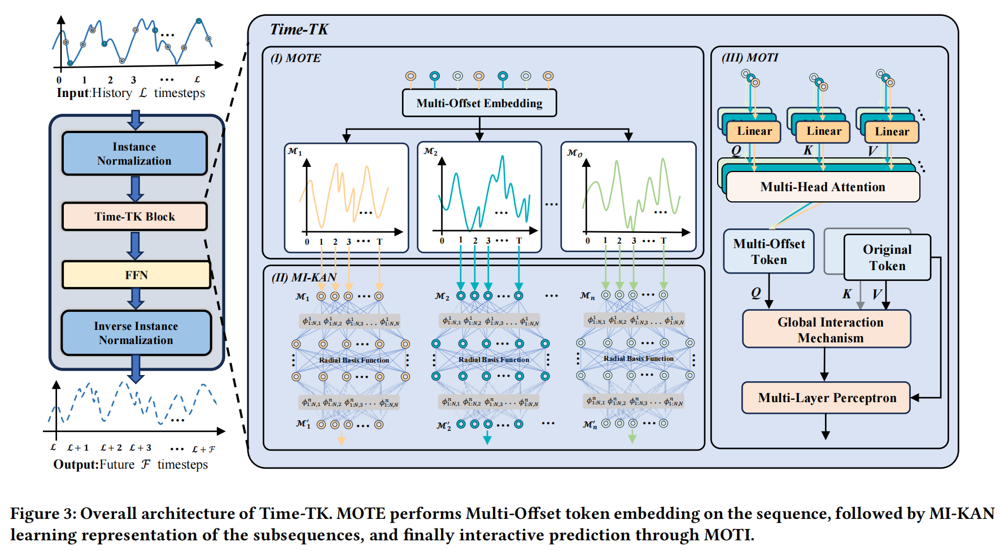

# Time-TK

<div align="center">


## Time-TK: A Multi-Offset Temporal Interaction Framework Combining Transformer and Kolmogorov-Arnold Networks for Time Series Forecasting

**The ACM Web Conference 2026 (WWW '26)**

[Paper](https://dl.acm.org/doi/abs/10.1145/3774904.3792618) | [Code](https://github.com/Cola-Fsm/Time-TK)

</div>

---

## Introduction

**Time-TK** is a lightweight time series forecasting framework designed to better capture fine-grained temporal dependencies across different time offsets.

Most existing forecasting methods represent time series using mixed embedding, inverted embedding, or patch embedding. Although effective, these strategies may overlook important dependencies distributed across different temporal offsets. To address this issue, we introduce **Multi-Offset Token Embedding (MOTE)**, which explicitly constructs multiple offset sub-sequences and preserves temporal information from different positions.

<div align="center">
  
</div>


<p align="center">
  <b>Figure 1.</b> Illustration of different time series embedding strategies. Time-TK introduces Multi-Offset Embedding to capture temporal dependencies across different offsets.
</p>


Based on MOTE, Time-TK further combines **Kolmogorov-Arnold Networks (KANs)** and efficient temporal interaction to model complex temporal dynamics.

---

## Model Architecture

The overall architecture of Time-TK is shown below.

<div align="center">
  
</div>


<p align="center">
  <b>Figure 2.</b> Overall architecture of Time-TK. MOTE performs Multi-Offset Token Embedding, MI-KAN learns representations of the offset sub-sequences, and MOTI performs temporal interaction and global information integration.
</p>

---

## Repository Structure

```text
Time-TK/
├── data_provider/          # Data loading and preprocessing
├── exp/                    # Experiment pipeline
├── generated_scripts/      # Experiment scripts
├── img/
│   ├── intr.png            # Illustration of embedding strategies
│   └── model.png           # Overall architecture of Time-TK
├── layers/                 # Basic network layers and FastKAN
├── models/                 # Time-TK and baseline models
├── utils/                  # Utility functions
├── run.py                  # Main entry point
├── requirements.txt        # Python dependencies
└── README.md
```

---

## Requirements

The main dependencies are:

- Python
- PyTorch
- NumPy
- Pandas
- Matplotlib
- Scikit-learn

Clone this repository and install the required packages:

```bash
git clone https://github.com/Cola-Fsm/Time-TK.git
cd Time-TK

pip install -r requirements.txt
```

---

## Datasets

Time-TK is evaluated on long-term forecasting, short-term forecasting, and web transaction forecasting benchmarks.

| Task                        | Datasets                                                     |
| --------------------------- | ------------------------------------------------------------ |
| Long-term forecasting       | ETTh1, ETTh2, ETTm1, ETTm2, Exchange, Weather, Electricity, Solar-Energy, Traffic |
| Short-term forecasting      | PEMS03, PEMS04, PEMS07, PEMS08                               |
| Web transaction forecasting | BTC/USDT                                                     |

For the main long-term forecasting benchmarks, the lookback length is set to **96**, and the prediction horizons are:

```text
{96, 192, 336, 720}
```

For PEMS datasets, the prediction horizons are:

```text
{12, 24, 48, 96}
```

The public datasets can be obtained from the following sources:

- [ETT Dataset](https://github.com/zhouhaoyi/ETDataset)
- [Exchange Rate Dataset](https://github.com/laiguokun/multivariate-time-series-data)
- [Weather Dataset](https://www.bgc-jena.mpg.de/wetter/)
- [Electricity Dataset](https://archive.ics.uci.edu/ml/datasets/ElectricityLoadDiagrams20112014)
- [Solar Energy Dataset](https://www.nrel.gov/grid/solar-power-data.html)
- [PEMS Dataset](https://pems.dot.ca.gov/)
- [BTC/USDT Dataset](https://www.kaggle.com/datasets/shivaverse/btcusdt-5-minute-ohlc-volume-data-2017-2025)

Please organize the downloaded datasets according to the paths specified in the experiment scripts.

---

## Training and Evaluation

Ready-to-use experiment configurations are provided in:

```text
generated_scripts/
```

Run the corresponding script for a dataset and prediction horizon:

```bash
bash generated_scripts/<script_name>.sh
```

Alternatively, experiments can be launched directly using:

```bash
python -u run.py [arguments]
```

Please refer to `run.py` and the scripts under `generated_scripts/` for the complete argument settings.


---

## Citation

If you find this repository useful, please cite our paper:

```bibtex
@inproceedings{zhang2026timetk,
  author    = {Fan Zhang and Shiming Fan and Hua Wang},
  title     = {Time-TK: A Multi-Offset Temporal Interaction Framework Combining Transformer and Kolmogorov-Arnold Networks for Time Series Forecasting},
  booktitle = {Proceedings of the ACM Web Conference 2026},
  pages     = {7495--7506},
  year      = {2026},
  doi       = {10.1145/3774904.3792618}
}
```

---

## Contact

If you have any questions regarding the paper or code, please submit an issue in this repository; you are also welcome to contact me via email for discussion and learning.

---

## Acknowledgements

We appreciate the following resources a lot for their valuable code and datasets:

- Time-Series-Library ([https://github.com/thuml/Time-Series-Library](https://github.com/thuml/Time-Series-Library))
- iTransformer ([https://github.com/thuml/iTransformer](https://github.com/thuml/iTransformer))
- BasicTS ([https://github.com/GestaltCogTeam/BasicTS](https://github.com/GestaltCogTeam/BasicTS))
- TFB ([https://github.com/decisionintelligence/TFB](https://github.com/decisionintelligence/TFB))
